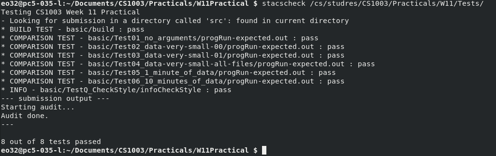

# W11 Practical

## Overview

### Initial Practical

The specification required that a program which uses Apache `Hadoop` to process twitter tweet data. The data is stored in `json` format. The program is required to taken in the data set and return the total number of tweets made by a user + location. The specification also requires that the class path of the `src` files be changed to be located in a bin file.

### Problem Decomposition

* Extract user name and location from `json`
* Extraction of `\n` and `\r` from strings as users can define their own username and location
* Create a mapper which concatenates the name of the user and their location if their location is not null.
* Reducer shall count the occurrences of a user tweeting in this location inside of the data set. 

### Extension: Sorting by Most tweets

Sort the data by users who made the most tweets at a location, given a command line argument by the user.

### Extension: Most popular Tweet Location

Instead of extracting the number of tweets by user at location only location is extracted. Then sorted in decreasing order.

### Extension: Most Popular Retweet Location

Determine the locations with the highest number of retweets by extracting the `retweed_count` from `json`.

### Extension: Variation of Runtime with number of concurrently running map threads

Vary the number of concurrently running map tasks and see how it effects the run time of the program.

## Design

### Initial Practical

#### Setup

The main class is responsible for the setup `hadoop` job. Here the setup is almost the same `everytime`. How to layout a map reduce project was detailed by:

*  https://hadoop.apache.org/docs/stable/hadoop-mapreduce-client/hadoop-mapreduce-client-core/MapReduceTutorial.html

This layouts allows for me to setup my own mapper and reducer and choose what to output to the reducer and what to output to the mapper. 

#### Mapper

The purpose of the mapper is to get a line of input from the file and extract the `screen_name` and `location` from the `json`. This allows for the concatenation of them both at the key and their value is set to 1 as it is one occurrence. The types of these have to be expressed in `Hadoop` types so:

* `Text` Will allow text to be represented in `Hadoop`. 
* `LongWritable` Will allow for a long integer to b e represented in `Hadoop`.

The mapper receives each line of text file as the value and the offset of  first character as the value. Since in this data set each new line is a new `json` object it was decided to convert each line into `json` object then navigating to `user` the `json` object within the object and then the values of `screen_name` and `location` were than accessible.

#### Reducer

The first thing that has to be ensured when creating the mapper was that the input of the mapper was identical to the output of the mapper. i.e. that `Text` and `LongWritable` were used as the key and value type for the reducer. Since the reducer would receive all the keys' values from then the reducer just summed up the total occurrences of  values in the key and that was set as the output. Since each occurrences represent a found tweet at a time. Then the output of the file was set to be contents of the file.

### Extension: Sorting

To sort the practical it was decided to use another map reduce job as for larger files this process would be done quicker as it would be done in parallel. To do this using map reduce it was decided that a second job would need to be done. This job would take in the last map reduce job done by the program as input. Then would parse each line of input again taking the number at the end of the file and multiplying it by negative 1 making it the key and then the rest of the line as the value. The reason this method was used for sorting as `Hadoop` sorts by keys in ascending order. So to make the largest first it was multiplied by negative one to invert the order. This is then change back to the regular number in the reducer for output in the correct order. This also allowed for further gathering of knowledge for the functionality of the `Hadoop` library. 

###  Extension: Most Popular Tweet Location

The first extension was used then adapted to only take out location instead user and location.

## Testing

### Stacscheck

Here it can be seen from the `stacscheck` that the expected output and the output of the program are identical. Showing the program does in fact meet the requirements of specification.



### Additional Tests


#### Extension: Sorting

It was manually checked that each number is decreasing after each and it can be seen from running the available script:

```bash
bash extension.bash
```

This script runs on the 10 minutes of data. As 1 minutes shows only maximum of 1 so no variation in amount is shown.

#### Extension: Popular

The is no way of knowing the output is correct as there is no file to compare to, but as can be seen from the output bash

```bash
bash extension-1.sh
```

The highest occurring location is the "United States" this makes sense as the majority of Twitters user base live in this location leading to believe that the output is correct.

#### Extension: Retweet

To run this Extension

```bash
bash extension-2.sh
```

Here its seems that all the retweet counts were 0. So from this 3 conclusions were gather

* The data set is gathered from recent tweets from the last 10 minutes. So there hasn't been enough time for them to actually to get likes.
* From the unit testing of the Mapper it works correctly and extracts the correct `json`. 
* More data would have be gathered to determine the functionality

#### Extension: Variation of threads

To get the run time varying threads between 1-10.

```bash
bash extension-3.sh
```

From the data given from the output of the bash the following diagram was plotted. This was done on a 4 core PC in John Honey Computer Science Lab. The more core used the more efficiently then plateaus when it exceeds 4 cores. This was ran with only terminal window open. 


## Evaluation

It was found that minimal changes had to be made to the initial practical from Word Count Example since they followed the same structure of just counting occurrences. So this made it very easy to build this practical upon that foundation. It can be seen from the passing of the `stacscheck` and the additional tests that the practical fully meets the specification of the initial practical

## Conclusion

In this practical a program which is capable of using `hadoop` map reducer to count occurrences of a user tweeting from a location was found. 

### Difficulties

* The program was extremely hard to test are a `System.out.prinln()` was non-functional as soon as the job began.
* The wasn't an abundance of output data to test output against.
* It was required to ensure that the characters were parsed using `UTF-8`

### Given More Time

* The variation of Threads could have been performed on all the extensions.

